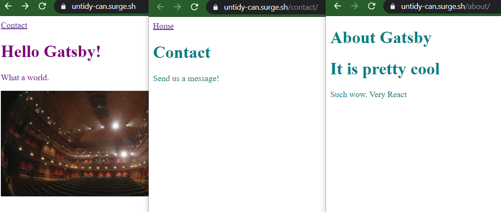

<h1>Gatsby - Hello-World:</h1>
https://untidy-can.surge.sh

</img>

<ul>
<li> /Home/Contact</li>
<li> /About</li>
</ul>

<strong>run localserver:</strong>
<strong>gatsby dev</strong>

static deploy: https://surge.sh/ 

gatsby intro: https://www.gatsbyjs.org/tutorial/
